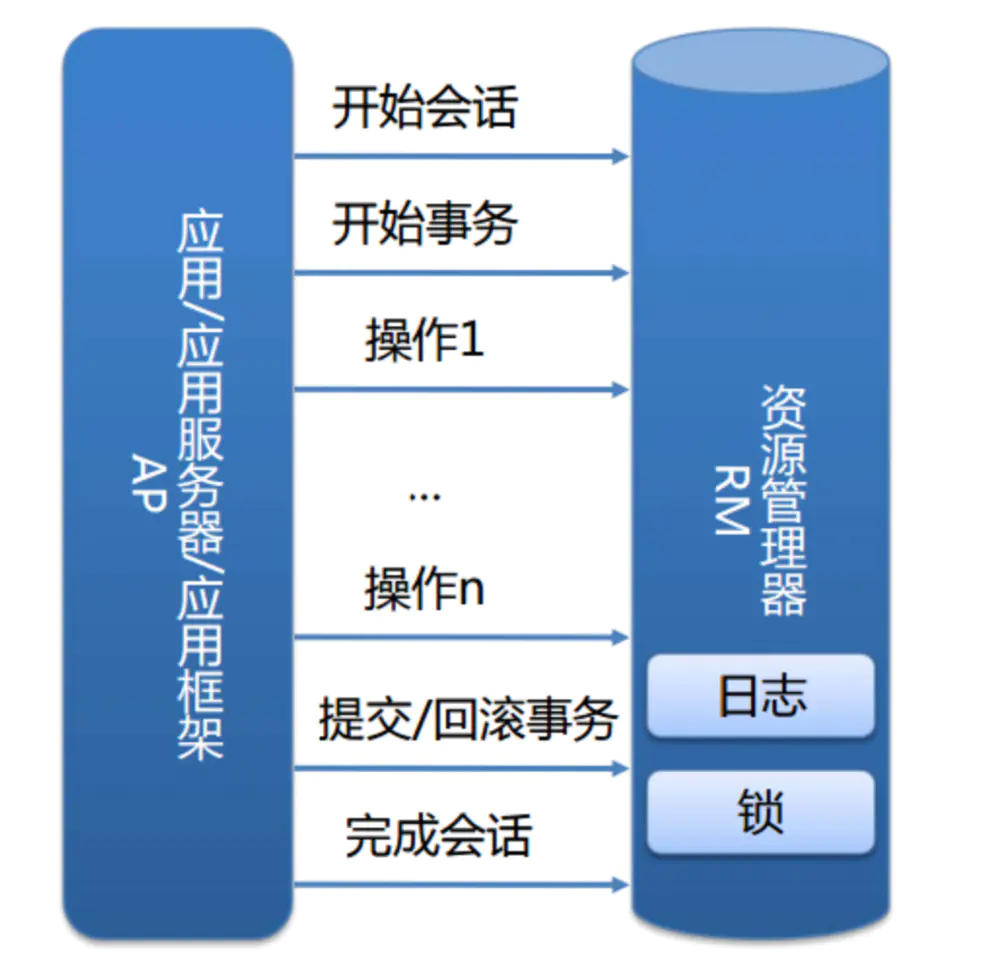

# 事务理论

## 数据库本地事务

#### ACID

* A：原子性\(Atomicity\)
* C：一致性\(Consistency\)
* I：隔离性\(Isolation\)
* D：持久性\(Durability\)

#### InnoDB实现原理

在本地事务中，服务和资源在事务的包裹下可以看做是一体的：

我们的本地事务由资源管理器：

而事务的ACID是通过InnoDB日志和锁来保证。事务的隔离性是通过数据库锁的机制实现的，持久性通过redo log（重做日志）来实现，原子性和一致性通过Undo log来实现。UndoLog的原理很简单，为了满足事务的原子性，在操作任何数据之前，首先将数据备份到一个地方（这个存储数据备份的地方称为UndoLog）。然后进行数据的修改。如果出现了错误或者用户执行了ROLLBACK语句，系统可以利用Undo Log中的备份将数据恢复到事务开始之前的状态。 和Undo Log相反，RedoLog记录的是新数据的备份。在事务提交前，只要将RedoLog持久化即可，不需要将数据持久化。当系统崩溃时，虽然数据没有持久化，但是RedoLog已经持久化。系统可以根据RedoLog的内容，将所有数据恢复到最新的状态。

## 分布式事务

#### 分布式事务产生的原因：service产生多个节点，resource产生多个节点

### 分布式事务的基础

#### CAP定理

* C\(一致性\):对某个指定的客户端来说，读操作能返回最新的写操作。对于数据分布在不同节点上的数据上来说，如果在某个节点更新了数据，那么在其他节点如果都能读取到这个最新的数据，那么就称为强一致，如果有某个节点没有读取到，那就是分布式不一致。
* A\(可用性\):非故障的节点在合理的时间内返回合理的响应\(不是错误和超时的响应\)。可用性的两个关键一个是合理的时间，一个是合理的响应。合理的时间指的是请求不能无限被阻塞，应该在合理的时间给出返回。合理的响应指的是系统应该明确返回结果并且结果是正确的，这里的正确指的是比如应该返回50，而不是返回40。
* P\(分区容错性\):当出现网络分区后，系统能够继续工作。打个比方，这里个集群有多台机器，有台机器网络出现了问题，但是这个集群仍然可以正常工作。

熟悉CAP的人都知道，三者不能共有，如果感兴趣可以搜索CAP的证明，在分布式系统中，网络无法100%可靠，分区其实是一个必然现象，如果我们选择了CA而放弃了P，那么当发生分区现象时，为了保证一致性，这个时候必须拒绝请求，但是A又不允许，所以分布式系统理论上不可能选择CA架构，只能选择CP或者AP架构。

对于CP来说，放弃可用性，追求一致性和分区容错性，我们的zookeeper其实就是追求的强一致。

对于AP来说，放弃一致性\(这里说的一致性是强一致性\)，追求分区容错性和可用性，这是很多分布式系统设计时的选择，后面的BASE也是根据AP来扩展。

顺便一提，CAP理论中是忽略网络延迟，也就是当事务提交时，从节点A复制到节点B，但是在现实中这个是明显不可能的，所以总会有一定的时间是不一致。同时CAP中选择两个，比如你选择了CP，并不是叫你放弃A。因为P出现的概率实在是太小了，大部分的时间你仍然需要保证CA。就算分区出现了你也要为后来的A做准备，比如通过一些日志的手段，是其他机器回复至可用。

#### BASE

BASE 是 Basically Available\(基本可用\)、Soft state\(软状态\)和 Eventually consistent \(最终一致性\)三个短语的缩写。是对CAP中AP的一个扩展

1. 基本可用:分布式系统在出现故障时，允许损失部分可用功能，保证核心功能可用。
2. 软状态:允许系统中存在中间状态，这个状态不影响系统可用性，这里指的是CAP中的不一致。
3. 最终一致:最终一致是指经过一段时间后，所有节点数据都将会达到一致。

BASE解决了CAP中理论没有网络延迟，在BASE中用软状态和最终一致，保证了延迟后的一致性。BASE和 ACID 是相反的，它完全不同于ACID的强一致性模型，而是通过牺牲强一致性来获得可用性，并允许数据在一段时间内是不一致的，但最终达到一致状态。

